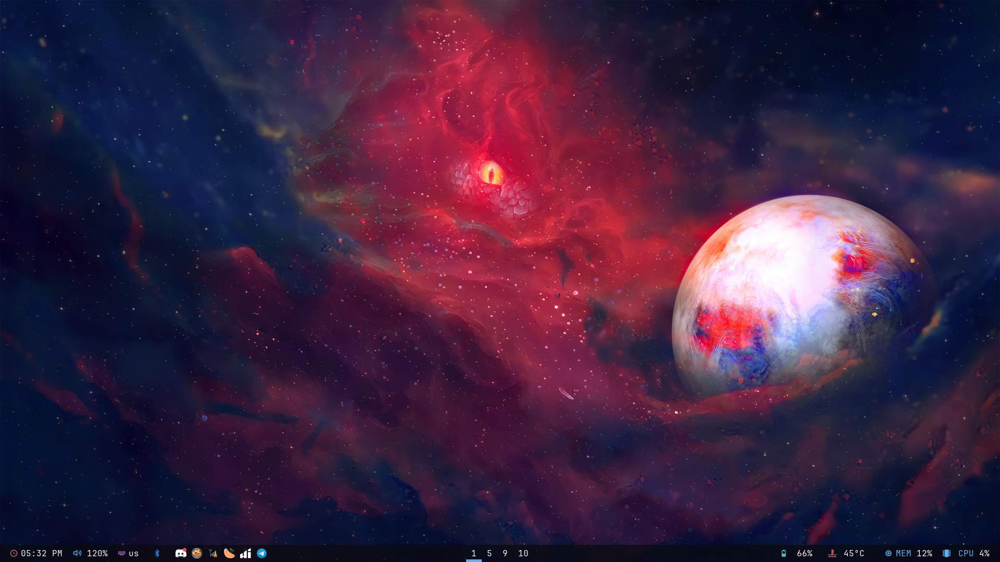
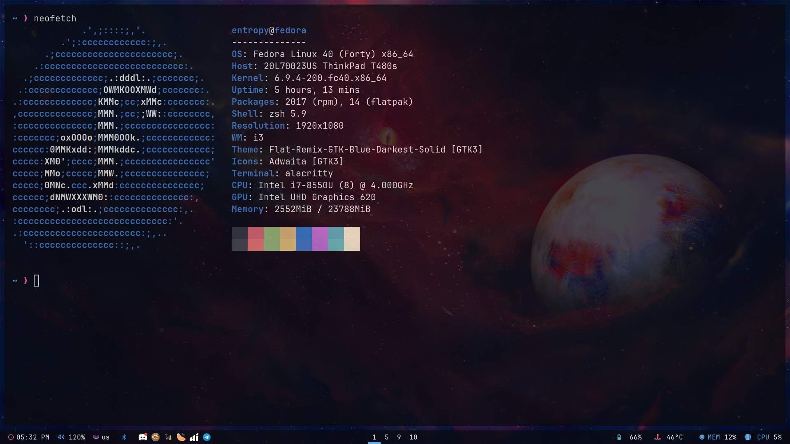
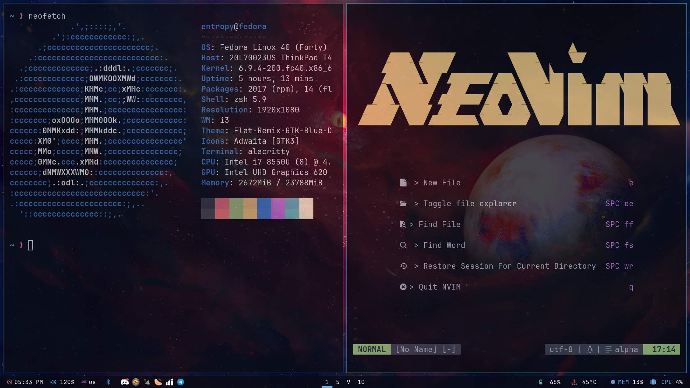
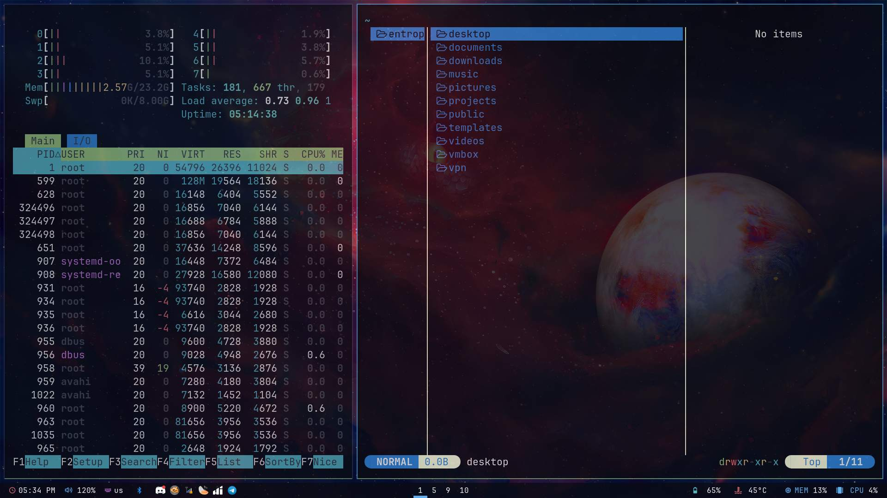

# My Dotfiles (Ver. 2.0)

Here is my updated dotfiles.
Read further for more instructions

## Requirements

- [i3](https://i3wm.org/)
- [Alacritty](https://alacritty.org/)
- [Yazi](https://yazi-rs.github.io/docs/installation)
- [yad-calendar](https://yad-guide.ingk.se/calendar/yad-calendar.html)
- [Neovim](https://neovim.io/)
- [RedShift](https://github.com/jonls/redshift)
- [Tmux](https://github.com/tmux/tmux/wiki/Installing)
- [Polybar](https://github.com/polybar/polybar)
- [Picom](https://github.com/yshui/picom)
- [Rofi](https://github.com/davatorium/rofi)
- [Überzug++](https://github.com/jstkdng/ueberzugpp)
- [Clementine](https://www.clementine-player.org/downloads)
- ffmpeg
- ffmpegthumbnailer
- unar
- jq
- poppler
- fd
- rg
- libnotify
- fzf
- zoxide
- xclip
- maim
- feh
- light
- acpi
- xinput

## How to use

- install [Stow](https://www.gnu.org/software/stow/)
- first clone the repository and move the contents to a directory in your home directory.
- cd into the directory
- use `stow */`
- enjoy!

## Images

